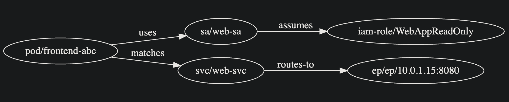

# Threat Modeling in EKS

`eks-security-scanner` helps visualize and assess potential attack paths within your Kubernetes cluster by constructing a **threat graph**. This graph-based approach supports basic threat modeling — helping you reason about lateral movement, privilege escalation, network exposure, and excessive trust relationships.

---

## What is Threat Modeling?

Threat modeling is the process of:
- Identifying assets (e.g., workloads, namespaces)
- Mapping access relationships (e.g., RBAC bindings, service account usage)
- Detecting risky configurations that increase the blast radius of a breach

In Kubernetes, attackers often exploit:
- Over-permissive service accounts
- Reused accounts across multiple services
- Misconfigured RBAC or IAM policies
- Unrestricted network access to sensitive endpoints

---

## Threat Graph Overview

When you run:

`eks-scanner graph -c <cluster>`

The tool builds a directed graph combining **identity paths** and **network paths**, including:

- **Pods → ServiceAccounts → IAM Roles** (identity/privilege escalation path)
- **Pods → Services → Endpoints** (network communication/exposure path)

This hybrid graph models both **who a pod runs as** and **what a pod can reach** within the cluster.

You can output the graph in:
- **ASCII** (default) — readable in terminal
- **DOT** — for use with Graphviz or visual tools such as https://edotor.net

---

## What to Look For

Here are key patterns to notice in your graph output:

### Reused Service Accounts
Multiple pods pointing to the same service account increases the impact of a compromise.

**Why it matters**: If any one of those pods is breached, the attacker gains the permissions of that shared SA.

### High-Privilege Nodes
Look for service accounts with cluster-wide permissions or access to sensitive APIs.

**Why it matters**: These SAs are high-value targets.

### Fan-in Patterns
If many pods route through a single service or service account, that may indicate a **privilege escalation chokepoint** or **centralized exposure**.

**Why it matters**: Attackers can move laterally or pivot more easily from compromised entry points.

### Broad Network Reach
Pods that connect to many services or endpoints across namespaces may have **excessive internal access**.

**Why it matters**: This breaks isolation boundaries and can allow sensitive systems to be discovered or exploited.

---

## Example (ASCII Format)


```
[POD] frontend-abc
  └─[uses]→ [SA]  web-sa
  └─[matches]→ [SVC] triton-inference-production/triton-inference
[SA]  web-sa
  └─[assumes]→ [IAM] iam-role/WebAppReadOnly
[SVC] web-svc
  └─[routes-to]→ [EP]  ep/ep/10.0.1.15:8080
```

---

## Example (DOT Format)

```
digraph eks_threat_graph {
  rankdir=LR;
  "pod/frontend-abc" -> "sa/web-sa" [label="uses"];
  "sa/web-sa" -> "iam-role/WebAppReadOnly" [label="assumes"];
  "pod/frontend-abc" -> "svc/web-svc" [label="matches"];
  "svc/web-svc" -> "ep/ep/10.0.1.15:8080" [label="routes-to"];
}
```

This output can be pasted into [edotor.net](https://edotor.net) to produce:



## Limitations

- The threat graph is *structural* — it shows configuration, not real-time behavior.
- It assumes attackers can compromise pods and escalate via available access paths.
- It does not yet account for runtime security tools, admission controls, or network policies that may limit actual access.

---

## Conclusion

Use the threat graph as a starting point to ask:
- What could an attacker access from here?
- Which nodes are overused, overly privileged, or overly connected?
- What changes would reduce lateral movement or exposure?

Use in conjunction with RBAC audits, privilege checks, and namespace configuration scans for a more complete security posture.
